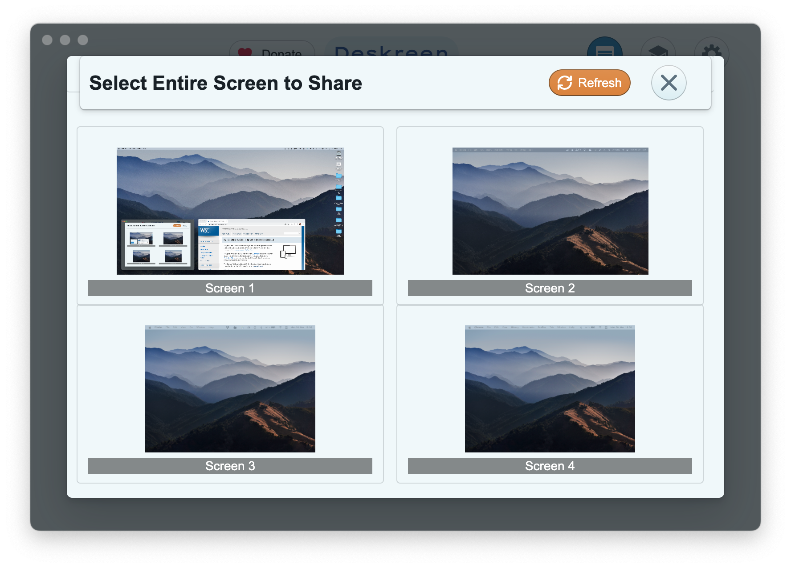
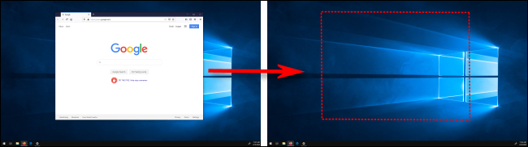
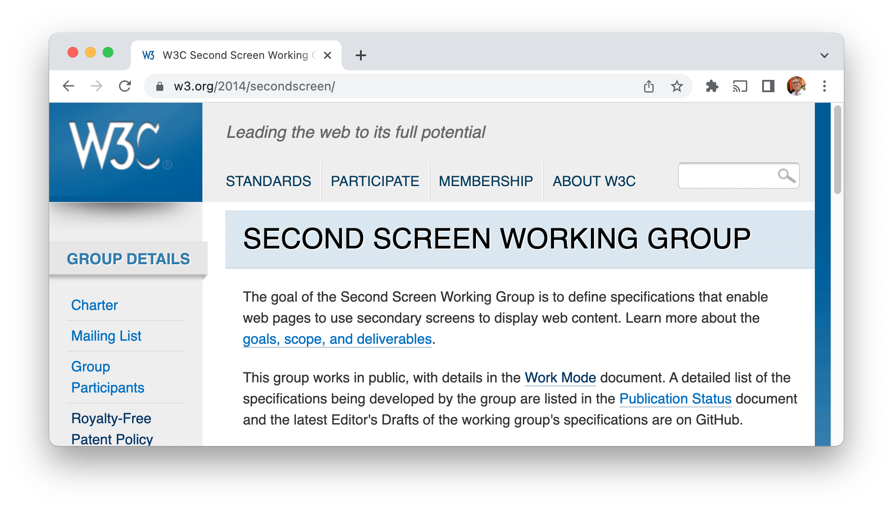
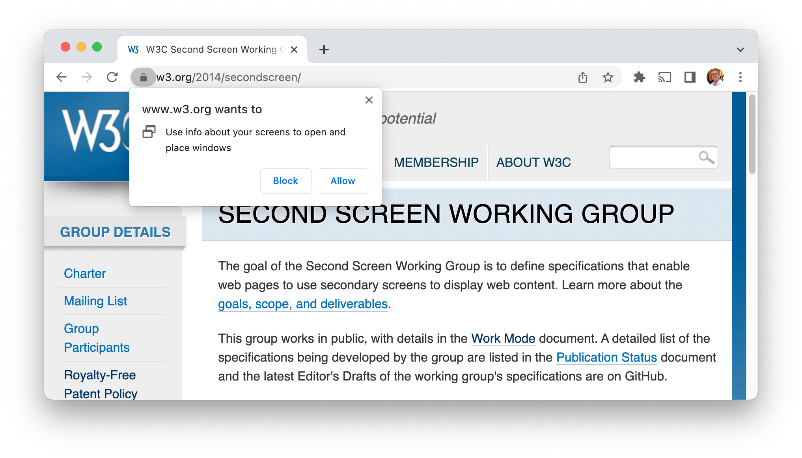
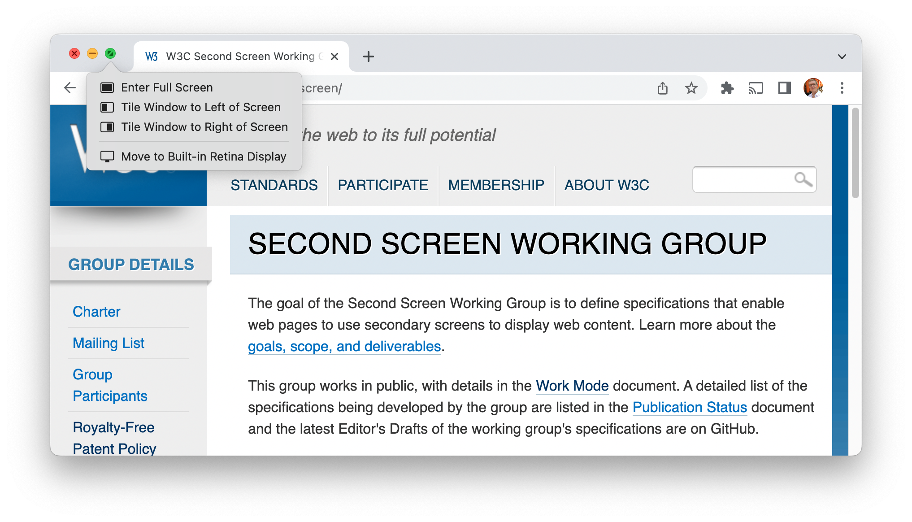
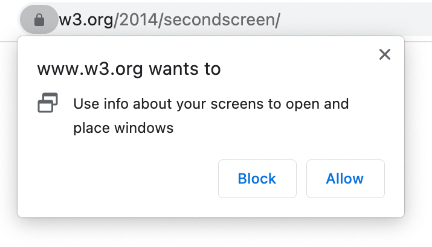
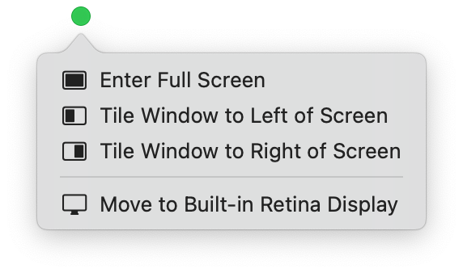

# **Virtual Display Use Case Exploration**

>A Collection of Interesting Ideas
## Second Screen WG/CG virtual meeting
## 8 June 2022
### [Anssi Kostiainen](mailto:anssi.kostiainen@intel.com)


---

<style>
  table, th, tr, td {
    border: 0px !important;
    border-collapse: collapse !important;
    border:none !important;
    outline:none !important;
}
</style>
<table>
<tr>
<td>
<iframe width="533" height="300" src="https://www.youtube-nocookie.com/embed/rmg5tZ4iSx8?start=34" title="YouTube video player" frameborder="0" allow="accelerometer; autoplay; clipboard-write; encrypted-media; gyroscope; picture-in-picture" allowfullscreen></iframe>

[Deskreen demo]

</td>
<td>
<iframe width="533" height="300" src="https://www.youtube-nocookie.com/embed/IbN9f8uNT2M?start=182" title="YouTube video player" frameborder="0" allow="accelerometer; autoplay; clipboard-write; encrypted-media; gyroscope; picture-in-picture" allowfullscreen></iframe>

[Sidecar demo]

</td>
</table>

[Deskreen demo]: https://www.youtube.com/watch?v=rmg5tZ4iSx8
[Sidecar demo]: https://youtu.be/IbN9f8uNT2M?t=180

---

# Virtual Display?

>_"a display instance without a physical connection to the graphics card"_
>
>_"a software representation of a physical display"_

---

# **UX Considerations 🤩**

---

* 1️⃣ 🚧 **Display Arrangement**
  * ➡️ OS
* 2️⃣ ✅ **Display Source Picker**
  * ➡️ [`getDisplayMedia()`]
  * ➡️ [`HTMLMediaElement.captureStream()`]?
* 3️⃣ 🚧 **Virtual Display Creation**
  * ➡️ OS
* 4️⃣ ✅ **Window Placement**
  * ➡️ OS
  * ➡️ [Multi-Screen Window Placement API]?
    * (Virtual workspaces/desktops a [non-goal], how about Virtual Displays?)


[non-goal]: https://github.com/w3c/window-placement/blob/main/EXPLAINER.md#non-goals

---

# 1️⃣ Display Arrangement 

---


---

# 2️⃣ Display Source Picker

---


(Chrome display source picker UI, https://www.webrtc-experiment.com/getDisplayMedia/)

---

# 3️⃣ Virtual Display Creation

---



(Deskreen Virtual Display Picker UI, https://deskreen.com/)

---

## 2️⃣ [`getDisplayMedia`] UI vs 3️⃣ [Deskreen] Virtual Display UI

---


---

# 4️⃣ Window Placement

---

## Implicit consent example: drag and drop

---



---

## OSes have a variety of implicit consenting mechanisms

- **Keyboard shortcuts** in [Windows]: "Windows logo key  + Shift + Left arrow or Right arrow to move an app or window in the desktop from one monitor to another."

- **Drag and drop evolved** in [macOS]: "Drag the app window you want to move to the edge of the screen [or]  enter Mission Control, then drag the window up to the space you want to use."

Could such implicit permission grants work for web app window placement?

[Windows]: https://support.microsoft.com/en-us/windows/keyboard-shortcuts-in-windows-dcc61a57-8ff0-cffe-9796-cb9706c75eec

[macOS]: https://support.apple.com/en-gb/guide/mac-help/mh14112/12.0/mac/12.0#mchlpd3f278c

---

## The traditional Web API approach: user's consent via browser prompt

---



---



---

## OS-level: controls built into window manager

---


---



---

## Browser prompt vs OS controls

---




---

# Goal: Enable UX innovation and protect the user's privacy

>How? Set a strong privacy baseline & leave room for Quality of Implementation differentiation?

---

# **Virtual Display support for the web**

## Ideation 🧪

---

## Goals

- _"Let me create a new virtual display surface & place windows on it, get its relative positioning and a representation I can pass on to other Web APIs."_
- [`MediaStream`] as the "common currency" for [`getDisplayMedia`] & WebRTC interop
- Reuse existing API constructs and browser and OS UI/UX

### Constraints

- Agnostic with regard to the display technology
- Meet security and privacy expectations

---

## Assumptions

- Web users expect [multi-screen use cases] to work similarly with Virtual Displays
- Web APIs shouldn't(?) fully abstract away virtual/physical display boundary

## Requirements (to make this a 1st class web capability) 👋

- A new virtual [display surface] type that maps to an OS-level concept
- Allow {[extending]|mirroring} of {[monitor]|[window]|[browser]} [display surface] to a virtual display surface
- User-initiated and programmatic window placement
- Use platform-native UX concepts (e.g. drag/move windows across, share controls)

[extending]: https://github.com/w3c/window-placement/issues/92#issuecomment-1092384046
[monitor]: https://www.w3.org/TR/screen-capture/#dfn-monitor
[window]: https://www.w3.org/TR/screen-capture/#dfn-windows
[browser]: https://www.w3.org/TR/screen-capture/#dfn-browser


---

## Related work

- Platform-level: open-source projects ([Deskreen]), mainstream product features ([Sidecar]) and more...

## Related, but different use cases

- Present a new document ([Presentation API]) or video element ([Remote Playback API])
- Share controls across devices: [Synergy]/[Barrier], [Logitech Flow], [Universal Control]
- Admin/advanced: various [Remote desktop software], [PowerToys FancyZones] layouts

---

# **Deskreen Experiments 🧪**

---


## Use Case 1️⃣: Browser of the tablet as an ad-hoc Virtual Display

>"_Sometimes_ I want to use the display of my tablet along with my primary device's display and let web apps make use of both. I want to be able to control what web content to present on my tablet."
---

<video src="demos/deskreen.mp4" controls width="960" height="540"></video>
[Download video as .mp4](demos/deskreen.mp4)

---

## Use Case 2️⃣: TV as an ad-hoc Virtual Display

>"_Sometimes_ when lounging in the living room I want to extend my workspace to the TV. I want to stay in control of what web content to share on the TV to a larger audience."

---

<video src="demos/deskreen+presentation-api.mp4" controls width="960" height="540"></video>
[Download video as .mp4](demos/deskreen+presentation-api.mp4)

---

## 1️⃣ Prototype Implementation Details

1. [Deskreen] mirrors a virtual display (created with [BetterDummy]) to a browser window on a tablet
- WebRTC MediaStream
- Same LAN

---

## Deskreen Architecture


See also: [session initiation sequence diagram](https://raw.githubusercontent.com/pavlobu/deskreen/master/doc/init-sharing-session/deskreen-webrtc-screen-sharing-session-initiation-pavlobu-22012021.svg)

---

## 2️⃣ Prototype Implementation Details

1. [Deskreen] mirrors a virtual display (created with [BetterDummy]) to an offscreen browser window
2. [Presentation API] mirrors that offscreen browser window to a TV connected to a Chromecast ([1-UA mode] triggered via browser UI)

- WebRTC MediaStream ➡️ [Cast Mirroring]
- Chromecast in same LAN


---

# **Design Noodling 🍜**

---

# 1️⃣ Display Arrangement

### ⚙️ OS & Platform APIs - built-in feature, some API gaps

- [Windows "multiple desktops"] / [VirtualDesktopManager]
- [macOS "spaces"] / no public API
- [Chrome OS "virtual desks"] / [Wayland API issues]

### 🌍 Web APIs

- [Virtual screen arrangement] readable via [`getScreenDetails()`]

---

# 2️⃣ Display Source Picker

### 🌍 Web APIs

- ✅ [`getDisplayMedia()`] satisfies "[display surface] to [`MediaStream`]" req / [screen mirroring/sharing use case]
- 🚧 Virtual display surface type
- 🚧 Picker UI for virtual displays (create a new?)


getDisplayMedia extension ideas (reusable for picking multiple virtual displays?):
- [getDisplayMedia issue #204: Concurrent capture of multiple surfaces](https://github.com/w3c/mediacapture-screen-share/issues/204)
- [Capture multiple surfaces w/ getDisplayMedia proposal](https://github.com/WICG/multicapture)
  

---

# 3️⃣ Virtual Display Creation

### ⚙️ OS & Platform APIs - "advanced users only"

- Windows: user-mode [indirect display driver model]
- macOS: 3rd party tools e.g. [BetterDummy]
- Linux: e.g. [GNOME headless native backend] in [Mutter]
- Generic: physical [Dummy Display Plugs], various [Virtual Display drivers]

### 🚫 Web APIs

- Virtual Display concept does not exists
   - Interesting parallels: [Audio Output Devices API](https://www.w3.org/TR/audio-output/) to allow routing audio to a "virtual" (other than the default) audio sink, see also [new sink available]

[new sink available]: https://www.w3.org/TR/audio-output/#algorithms-new-sink-available

---

# **API Ideation 💡**

---

#### Reusable concepts

- [display surface] and its [`DisplayCaptureSurfaceType`]
- [`CursorCaptureConstraint`]
- [virtual screen arrangement], [`isExtended`], [`getScreenDetails()`]

#### [`getDisplayMedia`] extensions

- Picker UI extended to allow a new Virtual Display creation
- Extend [`DisplayCaptureSurfaceType`] enum with `virtual`
- Reuse existing signaling of [closed/minimized display surfaces](https://www.w3.org/TR/screen-capture/#hidden-display-surfaces)
- ...

---

# IDL sketch

```
partial interface MediaDevices {
  Promise<MediaStream> getDisplayMedia(optional DisplayMediaStreamConstraints constraints = {});
};

enum DisplayCaptureSurfaceType {
  "monitor",
  "window",
  "browser",
  "virtual" // new
};
```

---

# Considered Alternatives

### New "`getDisplaySurface`" API

- Redundant if `getDisplayMedia` extensions satisfy reqs

### Presentation API extension

- [Presentation API Presentation of objects proposal] incl. `MediaStream`
- [Site Initiated Mirroring API]
  - [getDisplayMedia extension]: "no API that allows a MediaStream to be sent directly to a secondary display (without going through WebRTC)."

### Remote Playback API extensions

- Remote Playback API via `HTMLMediaElement.srcObject = ms` too much indirection

[Site Initiated Mirroring API]: https://github.com/webscreens/site-initiated-mirroring/blob/main/explainer.md
[getDisplayMedia extension]: https://github.com/webscreens/site-initiated-mirroring/blob/main/explainer.md#extend-getdisplaymedia


---

# **Possible path from an Exploration onwards**

---

* 1️⃣  &nbsp; Explainer [🔗](https://github.com/w3ctag/tag.w3.org/blob/main/explainers/template.md)
  * >Use cases, reqs, API sketch, considered alternatives &nbsp; &nbsp; `📍We are here!`
* 2️⃣  &nbsp; Explainer review
  * >Web community, browser & OS vendors, hardware ecosystem
* 3️⃣  &nbsp; Draft web spec
  * >W3C Second Screen CG in collaboration with WebRTC WG?
* 4️⃣ &nbsp;🧪 Prototype in code
  * >Example: [Chromium](https://www.chromium.org/blink/launching-features/) launch process
* 5️⃣ &nbsp;📢 Prototype feedback
  * >Web developer feedback can change the shape of the API significantly
* 6️⃣  &nbsp; Standards track
  * > Subject to support, possible WG adoption

---

# **`</html>`**

<!--
# References

## Specs
-->

[`DisplayCaptureSurfaceType`]: https://www.w3.org/TR/screen-capture/#dom-displaycapturesurfacetype
[`CursorCaptureConstraint`]: https://www.w3.org/TR/screen-capture/#cursorcaptureconstraint
[virtual screen arrangement]: https://w3c.github.io/window-placement/#virtual-screen-arrangement
[`isExtended`]: https://w3c.github.io/window-placement/#dom-screen-isextended
[`getScreenDetails()`]: https://w3c.github.io/window-placement/#dom-window-getscreendetails
[`getDisplayMedia()`]: https://www.w3.org/TR/screen-capture/#dom-mediadevices-getdisplaymedia
[`getDisplayMedia`]: https://www.w3.org/TR/screen-capture/#dom-mediadevices-getdisplaymedia
[`HTMLMediaElement.captureStream()`]:https://w3c.github.io/mediacapture-fromelement/#dom-htmlmediaelement-capturestream
[display surface]: https://www.w3.org/TR/screen-capture/#dfn-display-surface
[multi-screen use cases]: https://w3c.github.io/window-placement/#motivations
[Presentation API]: https://www.w3.org/TR/presentation-api/
[Remote Playback API]: https://www.w3.org/TR/remote-playback/
[1-UA mode]: https://w3c.github.io/presentation-api/#dfn-1-ua
[Multi-Screen Window Placement API]: https://w3c.github.io/window-placement/
[`MediaStream`]: https://www.w3.org/TR/mediacapture-streams/#dom-mediastream
[screen mirroring/sharing use case]: https://www.w3.org/TR/screen-capture/#intro
[Presentation API Presentation of objects proposal]: https://github.com/w3c/presentation-api/issues/439
[virtual screen arrangement]: https://w3c.github.io/window-placement/#concept-virtual-screen-arrangement
[Streaming MediaStreams]: https://domenic.github.io/streaming-mediastreams/

<!--
## Product-related
-->

[Deskreen]: https://deskreen.com/
[Sidecar]: https://support.apple.com/en-gb/HT210380
[Synergy]: https://en.wikipedia.org/wiki/Synergy_(software)
[Barrier]: https://github.com/debauchee/barrier
[Logitech Flow]: https://www.youtube.com/watch?v=0rs6WMN0uUE
[Universal Control]: https://support.apple.com/en-ca/HT212757
[Remote desktop software]: https://en.wikipedia.org/wiki/Remote_desktop_software
[PowerToys FancyZones]: https://docs.microsoft.com/en-us/windows/powertoys/fancyzones
[BetterDummy]: https://github.com/waydabber/BetterDummy
[Cast Mirroring]: https://source.chromium.org/chromium/chromium/src/+/main:components/mirroring/
[Windows "multiple desktops"]: https://support.microsoft.com/en-us/windows/multiple-desktops-in-windows-36f52e38-5b4a-557b-2ff9-e1a60c976434
[VirtualDesktopManager]: https://docs.microsoft.com/en-us/windows/win32/shell/virtualdesktopmanager
[macOS "spaces"]: https://support.apple.com/en-gb/guide/mac-help/mh14112/mac
[Chrome OS "virtual desks"]: https://chromeos.dev/en/productivity/virtual-desktops
[Wayland API issues]: https://github.com/w3c/window-placement/issues/68
[indirect display driver model]: https://docs.microsoft.com/en-us/windows-hardware/drivers/display/indirect-display-driver-model-overview
[GNOME headless native backend]: https://www.phoronix.com/scan.php?page=news_item&px=GNOME-40-Headless-Virtual
[Mutter]: https://gitlab.gnome.org/GNOME/mutter
[Dummy Display Plugs]: https://www.google.com/search?q=%22dummy+display+plug%22
[Virtual Display drivers]: https://github.com/pavlobu/deskreen/discussions/86

<!--
## Somewhat Related Demos
-->

[gUM demo]: https://www.webrtc-experiment.com/getDisplayMedia/
[Photowall]: https://googlechromelabs.github.io/presentation-api-samples/photowall/
[MediaStreamRecorder Demos]: https://www.webrtc-experiment.com/msr/

---