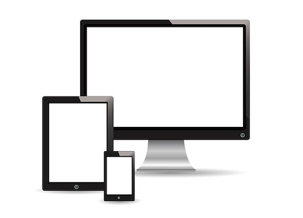
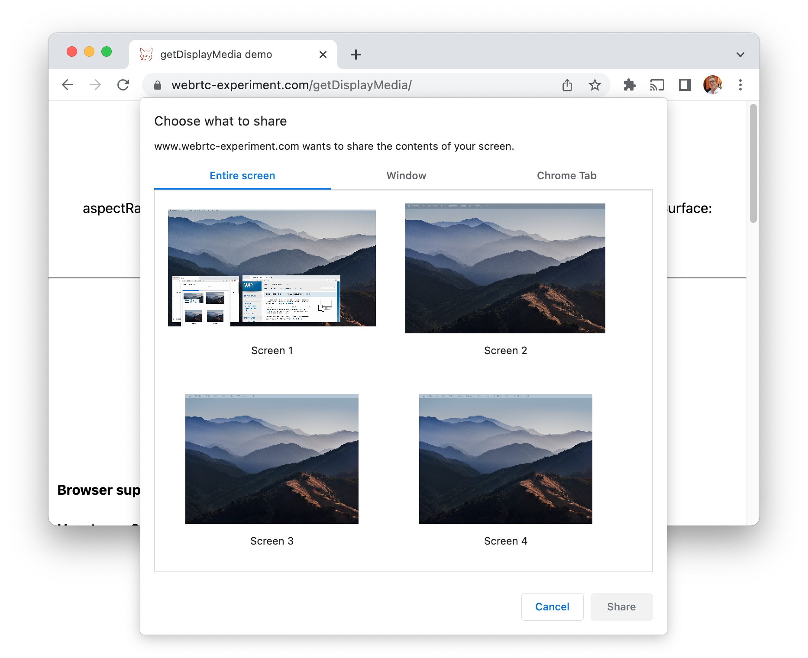
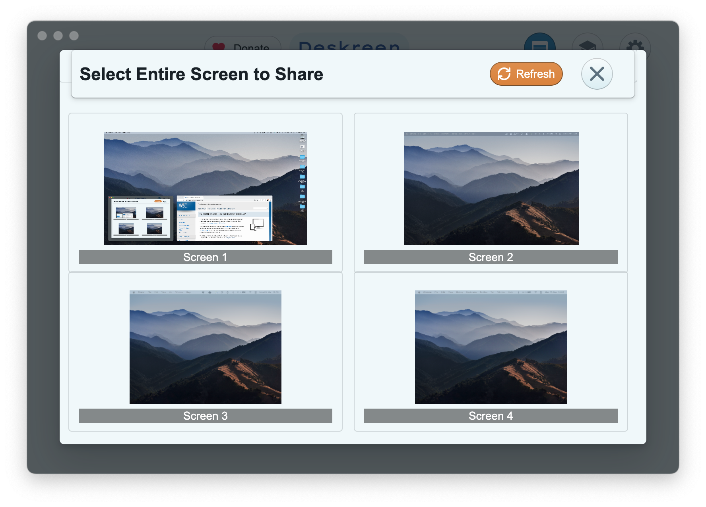
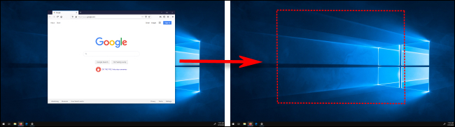
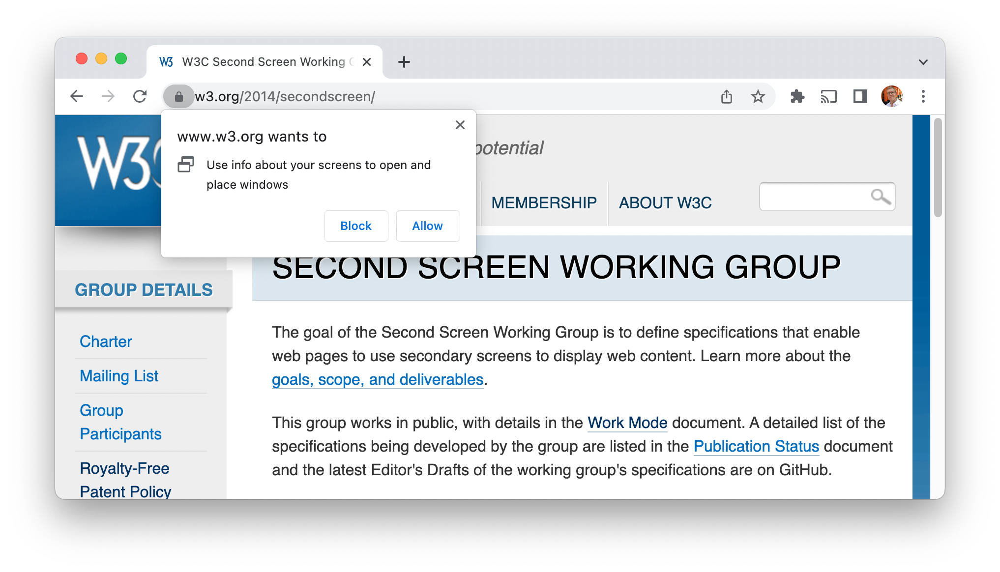
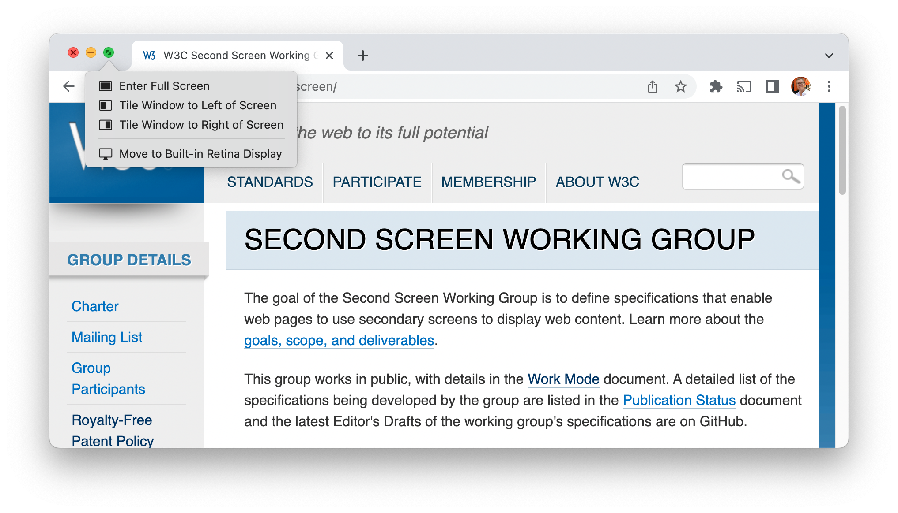
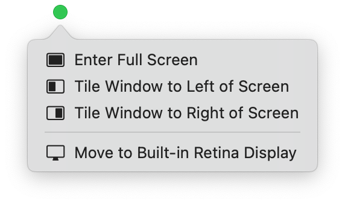

# **Permissions UX in Multi-Screen Experiences**

## W3C Workshop on Permissions
## 5 Dec 2022
### [Anssi Kostiainen](mailto:anssi.kostiainen@intel.com)

---

# Multi-Screen Experiences? 🔮

<table>
<tr>
<td>
<iframe width="533" height="300" src="https://www.youtube-nocookie.com/embed/rmg5tZ4iSx8?start=34" title="YouTube video player" frameborder="0" allow="accelerometer; autoplay; clipboard-write; encrypted-media; gyroscope; picture-in-picture" allowfullscreen></iframe>

[Deskreen demo]

</td>
<td>
<iframe width="533" height="300" src="https://www.youtube-nocookie.com/embed/IbN9f8uNT2M?start=182" title="YouTube video player" frameborder="0" allow="accelerometer; autoplay; clipboard-write; encrypted-media; gyroscope; picture-in-picture" allowfullscreen></iframe>

[Sidecar demo]

</td>
</table>

[Deskreen demo]: https://www.youtube.com/watch?v=rmg5tZ4iSx8
[Sidecar demo]: https://youtu.be/IbN9f8uNT2M?t=180

---

# What do you view as the single biggest shortcoming or challenge of the permission models deployed today?

* >Many mainstream permissions UX patterns work the best on desktop browsers, since they were first invented in that era. Let's take Drag and Drop as the most obvious example. A DnD-based permissions UX should not be a normative requirement. There should be instead a higher-level permissions abstraction that enables different implementations (DnD, modal dialog, non-modal toast dialog ...).

---

# Decomposing the Permissions UX in Multi-Screen Experiences _for the Web_

---

* 1️⃣ 🚧 **Display Arrangement**
  * ➡️ OS
* 2️⃣ ✅ **Display Source Picker**
  * ➡️ [`getDisplayMedia()`]
  * ➡️ [`HTMLMediaElement.captureStream()`]?
* 3️⃣ 🚧 **Virtual Display Creation**
  * ➡️ OS
* 4️⃣ ✅ **Window Placement**
  * ➡️ OS
  * ➡️ [Multi-Screen Window Placement API]?
    * (Virtual workspaces/desktops a [non-goal] currently)

[non-goal]: https://github.com/w3c/window-placement/blob/main/EXPLAINER.md#non-goals

---

# 1️⃣ Display Arrangement 

---

---

# 2️⃣ Display Source Picker

---

(Chrome display source picker UI, https://www.webrtc-experiment.com/getDisplayMedia/)

---

# 3️⃣ Virtual Display Creation

---

(Deskreen Virtual Display Picker UI, https://deskreen.com/)

---

## 2️⃣ [`getDisplayMedia`] UI vs 3️⃣ [Deskreen] Virtual Display UI

---

---

# 4️⃣ Window Placement

---

## Implicit consent example: drag and drop

---

---

## OSes have a variety of implicit consenting mechanisms

- **Keyboard shortcuts** in [Windows]: "Windows logo key  + Shift + Left arrow or Right arrow to move an app or window in the desktop from one monitor to another."

- **Drag and drop evolved** in [macOS]: "Drag the app window you want to move to the edge of the screen [or]  enter Mission Control, then drag the window up to the space you want to use."

Could such implicit permission grants work for web app window placement?

[Windows]: https://support.microsoft.com/en-us/windows/keyboard-shortcuts-in-windows-dcc61a57-8ff0-cffe-9796-cb9706c75eec

[macOS]: https://support.apple.com/en-gb/guide/mac-help/mh14112/12.0/mac/12.0#mchlpd3f278c

---

## The traditional Web API approach: user's consent via browser prompt

---

---

---

## OS-level: controls built into window manager

---

---

---

## Browser prompt vs OS controls

---

---

# Permissions challenge?

* Enable permissions UX innovation 💡 and protect the user's privacy 🔒
  * 🔮 in a future-proof manner
  * ⌚ also on non-desktop-browser contexts

* Things to do to get there
  * 🦎 Does the permissions UX adapt to non-desktop-browser contexts? XR context? On a watch? TV with a remote? With voice control using a home assistant?
  * ⚙️ Define permissions abstractions that enable context-sensitive implementations and leave room for Quality of Implementation differentiation and UX innovation
  * 🤟 _Your_ idea goes here

---

# ✋ Discussion

---

<!--
# References

## Specs
-->

[`DisplayCaptureSurfaceType`]: https://www.w3.org/TR/screen-capture/#dom-displaycapturesurfacetype
[`CursorCaptureConstraint`]: https://www.w3.org/TR/screen-capture/#cursorcaptureconstraint
[virtual screen arrangement]: https://w3c.github.io/window-placement/#virtual-screen-arrangement
[`isExtended`]: https://w3c.github.io/window-placement/#dom-screen-isextended
[`getScreenDetails()`]: https://w3c.github.io/window-placement/#dom-window-getscreendetails
[`getDisplayMedia()`]: https://www.w3.org/TR/screen-capture/#dom-mediadevices-getdisplaymedia
[`getDisplayMedia`]: https://www.w3.org/TR/screen-capture/#dom-mediadevices-getdisplaymedia
[`HTMLMediaElement.captureStream()`]:https://w3c.github.io/mediacapture-fromelement/#dom-htmlmediaelement-capturestream
[display surface]: https://www.w3.org/TR/screen-capture/#dfn-display-surface
[multi-screen use cases]: https://w3c.github.io/window-placement/#motivations
[Presentation API]: https://www.w3.org/TR/presentation-api/
[Remote Playback API]: https://www.w3.org/TR/remote-playback/
[1-UA mode]: https://w3c.github.io/presentation-api/#dfn-1-ua
[Multi-Screen Window Placement API]: https://w3c.github.io/window-placement/
[`MediaStream`]: https://www.w3.org/TR/mediacapture-streams/#dom-mediastream
[screen mirroring/sharing use case]: https://www.w3.org/TR/screen-capture/#intro
[Presentation API Presentation of objects proposal]: https://github.com/w3c/presentation-api/issues/439
[virtual screen arrangement]: https://w3c.github.io/window-placement/#concept-virtual-screen-arrangement
[Streaming MediaStreams]: https://domenic.github.io/streaming-mediastreams/

<!--
## Product-related
-->

[Deskreen]: https://deskreen.com/
[Sidecar]: https://support.apple.com/en-gb/HT210380
[Synergy]: https://en.wikipedia.org/wiki/Synergy_(software)
[Barrier]: https://github.com/debauchee/barrier
[Logitech Flow]: https://www.youtube.com/watch?v=0rs6WMN0uUE
[Universal Control]: https://support.apple.com/en-ca/HT212757
[Remote desktop software]: https://en.wikipedia.org/wiki/Remote_desktop_software
[PowerToys FancyZones]: https://docs.microsoft.com/en-us/windows/powertoys/fancyzones
[BetterDummy]: https://github.com/waydabber/BetterDummy
[Cast Mirroring]: https://source.chromium.org/chromium/chromium/src/+/main:components/mirroring/
[Windows "multiple desktops"]: https://support.microsoft.com/en-us/windows/multiple-desktops-in-windows-36f52e38-5b4a-557b-2ff9-e1a60c976434
[VirtualDesktopManager]: https://docs.microsoft.com/en-us/windows/win32/shell/virtualdesktopmanager
[macOS "spaces"]: https://support.apple.com/en-gb/guide/mac-help/mh14112/mac
[Chrome OS "virtual desks"]: https://chromeos.dev/en/productivity/virtual-desktops
[Wayland API issues]: https://github.com/w3c/window-placement/issues/68
[indirect display driver model]: https://docs.microsoft.com/en-us/windows-hardware/drivers/display/indirect-display-driver-model-overview
[GNOME headless native backend]: https://www.phoronix.com/scan.php?page=news_item&px=GNOME-40-Headless-Virtual
[Mutter]: https://gitlab.gnome.org/GNOME/mutter
[Dummy Display Plugs]: https://www.google.com/search?q=%22dummy+display+plug%22
[Virtual Display drivers]: https://github.com/pavlobu/deskreen/discussions/86

<!--
## Somewhat Related Demos
-->

[gUM demo]: https://www.webrtc-experiment.com/getDisplayMedia/
[Photowall]: https://googlechromelabs.github.io/presentation-api-samples/photowall/
[MediaStreamRecorder Demos]: https://www.webrtc-experiment.com/msr/

---